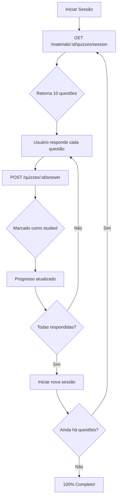

# 📊 Sistema de Progresso de Quizzes

Sistema completo de progresso para quizzes, permitindo que usuários respondam questões em sessões de 10 perguntas até completar 100% do material.

## 🎯 Visão Geral

- **30 quizzes por material** (gerados automaticamente pela IA)
- **Sessões de 10 questões** não estudadas
- **Progresso em %** (0% a 100%)
- **Marcação automática** quando respondido
- **Reset de progresso** para refazer

## 📐 Arquitetura

### Database Schema
```typescript
export const quizzes = pgTable("quizzes", {
  id: uuid().primaryKey().defaultRandom(),
  question: text().notNull(),
  options: jsonb().notNull(),
  correct_answer: text().notNull(),
  studied: boolean().default(false).notNull(), // ✨ NOVO
  user_id: uuid().references(() => users.id),
  material_id: uuid().references(() => materials.id),
  created_at: timestamp("created_at").notNull().defaultNow(),
});
```

### Repository Methods
```typescript
interface QuizzesRepository {
  // Métodos existentes
  findByMaterialId(materialId: string): Promise<Quiz[]>;
  findById(id: string): Promise<Quiz | null>;
  findManyByUserId(...): Promise<QuizListItem[]>;

  // ✨ Novos métodos para progresso
  findUnstudiedByMaterialId(materialId: string, limit: number): Promise<Quiz[]>;
  markAsStudied(quizId: string): Promise<Quiz>;
  countByMaterialId(materialId: string): Promise<number>;
  countStudiedByMaterialId(materialId: string): Promise<number>;
  resetProgress(materialId: string): Promise<void>;
}
```

## 🚀 Rotas Implementadas

### 1. Iniciar Sessão de Quiz
```http
GET /materials/:materialId/quizzes/session
Authorization: Bearer {token}
```

**Resposta:**
```json
{
  "quizzes": [
    {
      "id": "uuid",
      "question": "Pergunta aqui?",
      "options": [
        { "id": "a", "text": "Opção A" },
        { "id": "b", "text": "Opção B" },
        { "id": "c", "text": "Opção C" },
        { "id": "d", "text": "Opção D" }
      ],
      "correct_answer": "a",
      "studied": false
    }
    // ... até 10 questões não estudadas
  ],
  "session_size": 10,
  "total_quizzes": 30,
  "studied_count": 10,
  "remaining_count": 20
}
```

### 2. Ver Progresso
```http
GET /materials/:materialId/quizzes/progress
Authorization: Bearer {token}
```

**Resposta:**
```json
{
  "material_id": "uuid",
  "total_quizzes": 30,
  "studied_count": 15,
  "remaining_count": 15,
  "progress_percentage": 50,
  "is_completed": false
}
```

### 3. Resetar Progresso
```http
POST /materials/:materialId/quizzes/reset
Authorization: Bearer {token}
```

**Resposta:**
```json
{
  "message": "Progress reset successfully"
}
```

### 4. Responder Quiz (Atualizado)
```http
POST /quizzes/:quizId/answer
Authorization: Bearer {token}

{
  "selectedAnswer": "a"
}
```

**Comportamento:**
- ✅ Marca quiz como `studied = true`
- ✅ Salva tentativa em `quiz_attempts`
- ✅ Atualiza `study_sessions`

## 🔄 Fluxo de Uso

### Sessão de Estudo Completa



### Exemplo de Uso (Frontend)

```typescript
// 1. Iniciar sessão
const sessionResponse = await fetch('/materials/123/quizzes/session', {
  headers: { Authorization: `Bearer ${token}` }
});
const { quizzes, studied_count, total_quizzes } = await sessionResponse.json();
// quizzes = array com 10 questões não estudadas

// 2. Responder cada questão
for (const quiz of quizzes) {
  const answer = await getUserAnswer(quiz);
  await fetch(`/quizzes/${quiz.id}/answer`, {
    method: 'POST',
    headers: {
      Authorization: `Bearer ${token}`,
      'Content-Type': 'application/json'
    },
    body: JSON.stringify({ selectedAnswer: answer })
  });
}

// 3. Verificar progresso
const progressResponse = await fetch('/materials/123/quizzes/progress', {
  headers: { Authorization: `Bearer ${token}` }
});
const { progress_percentage, is_completed } = await progressResponse.json();

if (is_completed) {
  console.log('Parabéns! Você completou 100% dos quizzes!');
} else {
  console.log(`Progresso: ${progress_percentage}%`);
}

// 4. Resetar para refazer (opcional)
if (userWantsToReset) {
  await fetch('/materials/123/quizzes/reset', {
    method: 'POST',
    headers: { Authorization: `Bearer ${token}` }
  });
}
```

## 📊 Cálculo de Progresso

```typescript
progress_percentage = (studied_count / total_quizzes) * 100

// Exemplos:
// 0/30 = 0%
// 10/30 = 33% (1ª sessão completa)
// 20/30 = 67% (2ª sessão completa)
// 30/30 = 100% ✅ (3ª sessão completa)
```

## 🎨 Componentes de UI Sugeridos

### Progress Bar
```tsx
<ProgressBar
  value={progress_percentage}
  max={100}
  label={`${studied_count}/${total_quizzes} questões`}
/>
```

### Session Counter
```tsx
<SessionInfo>
  <p>Sessão atual: {Math.ceil(studied_count / 10)} / 5</p>
  <p>Questões restantes: {remaining_count}</p>
</SessionInfo>
```

### Completion Badge
```tsx
{is_completed && (
  <Badge variant="success">
    🎉 100% Completo!
  </Badge>
)}
```

## ⚙️ Configurações

### Quantidade de Quizzes
Definido em `src/utils/ai.ts`:
```typescript
const DEFAULT_QUIZZES = 50; // Total de quizzes gerados
```

### Tamanho da Sessão
Definido em `StartQuizSessionService`:
```typescript
private readonly SESSION_SIZE = 10; // Questões por sessão
```

## 🔐 Validações

Todas as rotas validam:
- ✅ Autenticação JWT
- ✅ Material existe
- ✅ Usuário é dono do material
- ✅ UUID válido

## 📈 Benefícios

1. **Gamificação**: Usuários veem progresso visual
2. **Repetição Espaçada**: Podem refazer após completar
3. **Sessões Curtas**: 10 questões é gerenciável
4. **Sem Duplicatas**: Só mostra questões não estudadas
5. **Analytics**: Rastreia tentativas e acertos

## 🧪 Testes

Testes E2E recomendados (não implementados ainda):
- [ ] Iniciar sessão deve retornar até 10 quizzes
- [ ] Responder quiz deve marcar como studied
- [ ] Progresso deve calcular % corretamente
- [ ] Reset deve marcar todos como não estudados
- [ ] Sessão completa deve atingir 100%

## 🎯 Próximos Passos

- [ ] Implementar testes E2E
- [ ] Adicionar tempo de resposta por quiz
- [ ] Estatísticas de performance (acertos por sessão)
- [ ] Badges de conquistas (10%, 50%, 100%)
- [ ] Leaderboard entre usuários